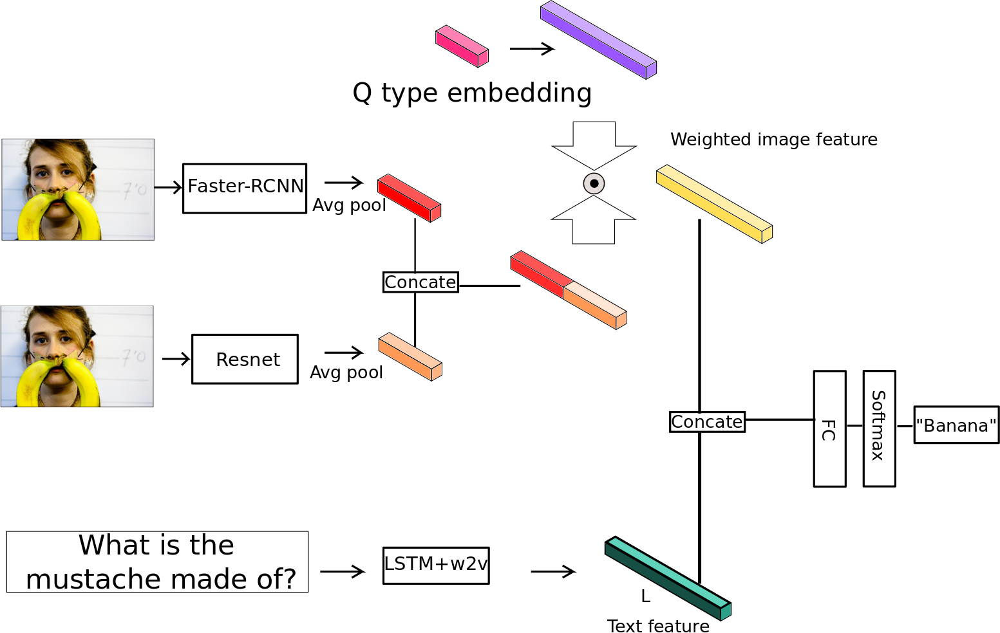
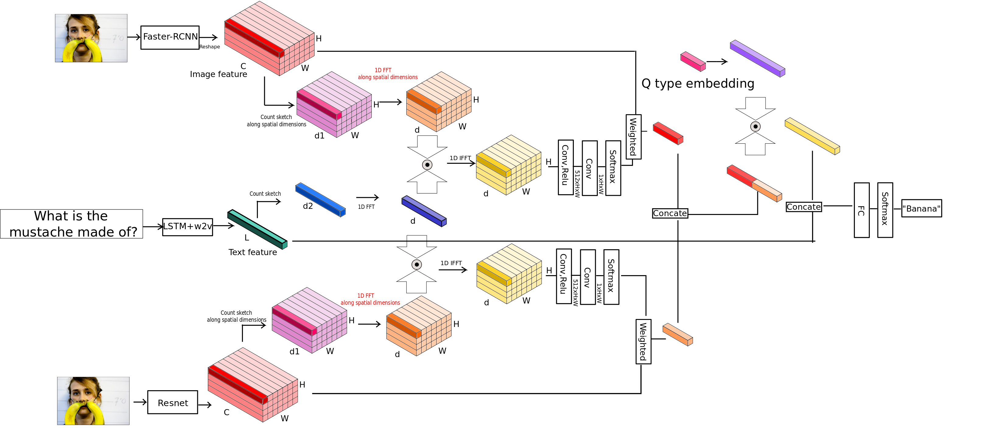
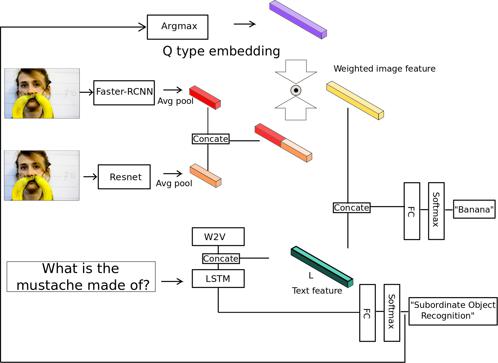

# Question-Type-Guided-Attention-in-VQA

This repo contrains codes on Visual Question Answer task using MXNET based on <a href="">"Question Type Guided Attention in Visual Question Answering"</a>.

Question Type-guided Attention(QTA) utilizes the information of question type to dynamically balance between bottom-up and top-down visual features, respectively extracted from ResNet and Faster R-CNN networks. To generalize QTA to applications
that lack of question type with minimal performance loss, we also propose a multitask extension to predict question types along with VQA task.

## Requirements

This code is written in Python and requires [MXNET](http://mxnet.io/). The preprocssinng code is in Python.

## Data Preprocessing
There are many different VQA dataset. You can choose whichever one you prefer. The data preprocessing is almost same for different datasets.
Here we use VQA v1 as an example.
Download original text datasets(annotation and question) from [VQA](http://www.visualqa.org/vqa_v1_download.html) and run

```
$ python textpreprocess.py
```
to get `vqa_raw_train.json`, `vqa_raw_test.json` and `vqa_raw_val.json`.

Once you have these, run

```
$ python prepro.py --input_train_json vqa_raw_train.json --input_val_json vqa_raw_val.json --input_test_json vqa_raw_test.json --num_ans 1000
```

to get the question features. `--num_ans` specifiy how many top answers you want to use during training. 
This will generate two files in your main folder, `data_prepro.h5` and `data_prepro.json`. 
`data_prepro.h5` contains questions and answers for train, validation and test sets. `data_prepro.json` contains index map for all words in questions and answers. 

If the dataset such as [TDIUC](http://kushalkafle.com/projects/tdiuc) contains information about question types. You should also preprocess a indexed list of question types for all training, validation and test samples.

We use pretrained resnet-152 network and pretrained faster r-cnn to get the image features. Please refer to [VQA-MCB](https://github.com/akirafukui/vqa-mcb/tree/master/preprocess) for resnet feature extraction 
and [bottom-up-attention](https://github.com/peteanderson80/bottom-up-attention) for faster r-cnn feature extraction. 

## Training
We present several models used in the QTA paper: CATL-QTA, MCB-QTA,CATL-QTA-M.

<p align="center">
   <b>CATL-QTA</b><br>

 </p>
 
<p align="center">
  <b>MCB-QTA</b><br>
  
</p>

<p align="center">
  <b>CATL-QTA-M</b><br>

</p>

## Testing
After training, you should have saved the model parameters in a .params file. Here we just load the model.
Run
```
$ python test.py
```
This will generate a .json file. Run 
```
$ python s2i.py
```
to make the result file readable to [VQA Evaluation Tool](https://github.com/VT-vision-lab/VQA/). Then you can use the [VQA Evaluation Tool](https://github.com/VT-vision-lab/VQA/) to evaluate.
