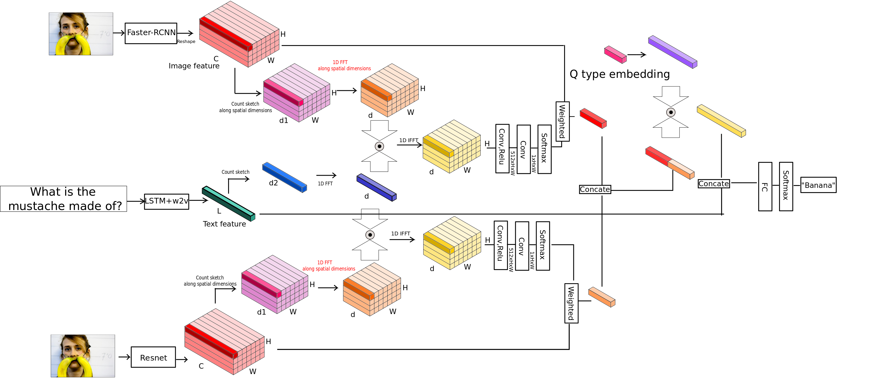

## Training
We present several models used in the QTA paper: CATL-QTA, MCB-QTA,CATL-QTA-M.

CATL-QTA: A one-layer MLP given concatenated output from a two-layer LSTM and two weighted pre-trained image vector features.

 

MCB-QTA: Two MCB with spatial attention using ResNet and Faster-RCNN as image feature respectively. 
  Text feature is a concatenation of output from a two-layer LSTM and Word2Vec question embedding and is shared for the two MCB parts. 
  The resulting MCB outputs are then weighted by question type. 
  Finally the weighted representation is concatenated with the text feature before feeding to a one-layer MLP.

  

CATL-QTA-M: A multi-task model based on CATL-QTA. Text feature is a concatenation of LSTM and Word2Vec embedding. 
  The output of LSTM is connected to a one-layer MLP to predict question type for the input question. 
  The prediction result is then fed into QTA part.

 

The above program requires question type informatin for each training/validation sample. 
However, after training on CATL-QTA-M, you can modify the network and use the existing model to fine tune for other dataset that doesn't have question type information.

plot.py is used to monitor the training preocess.
